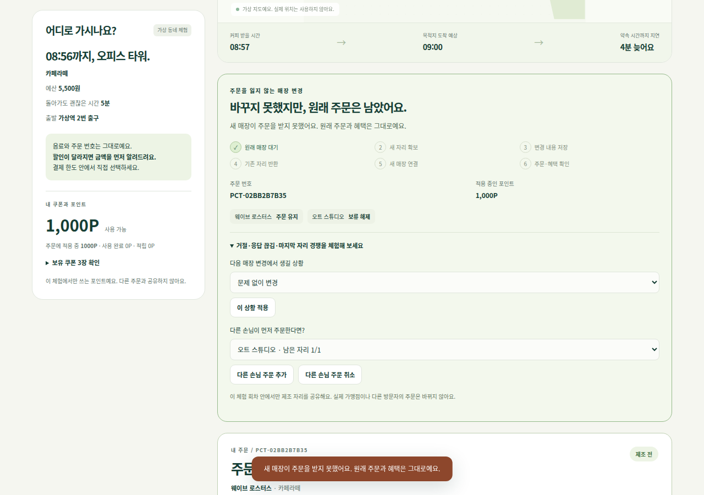
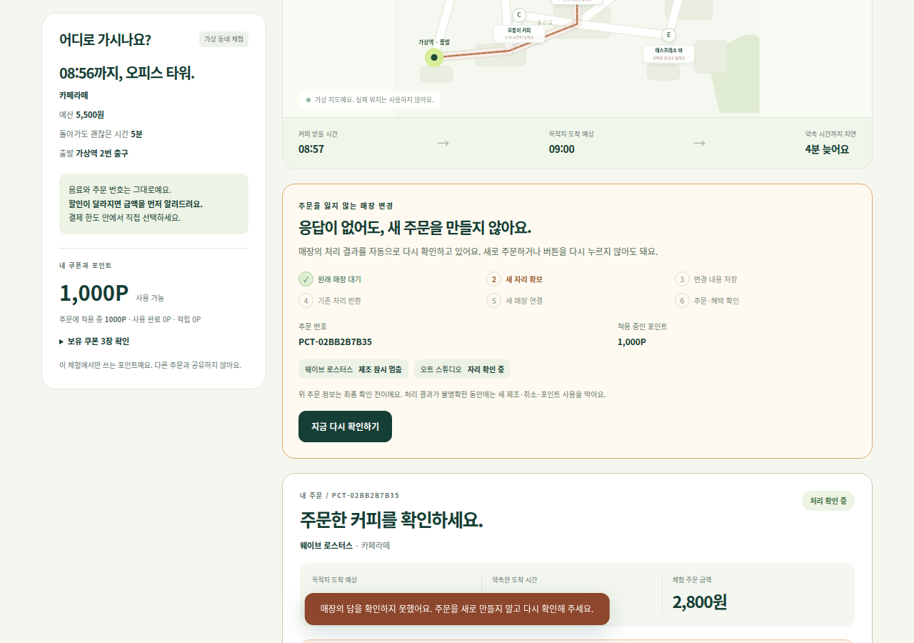
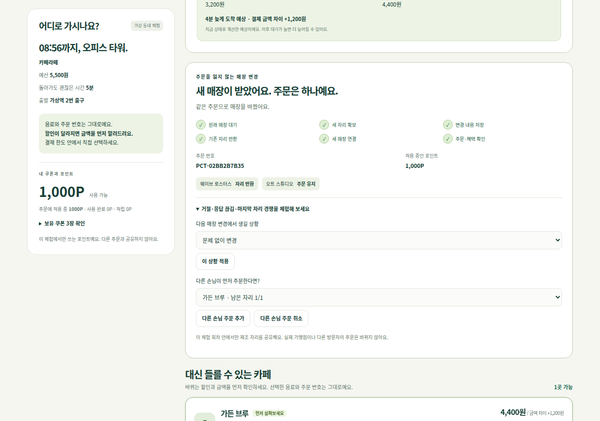
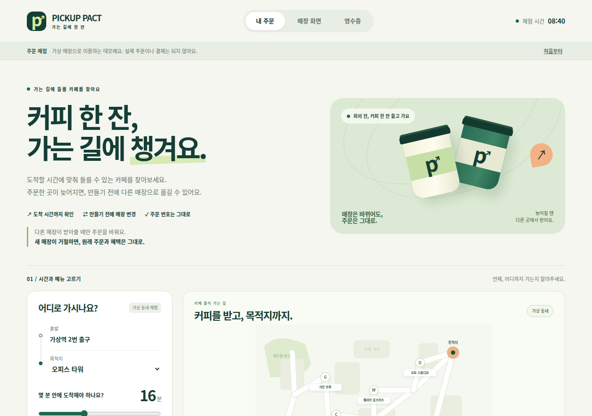
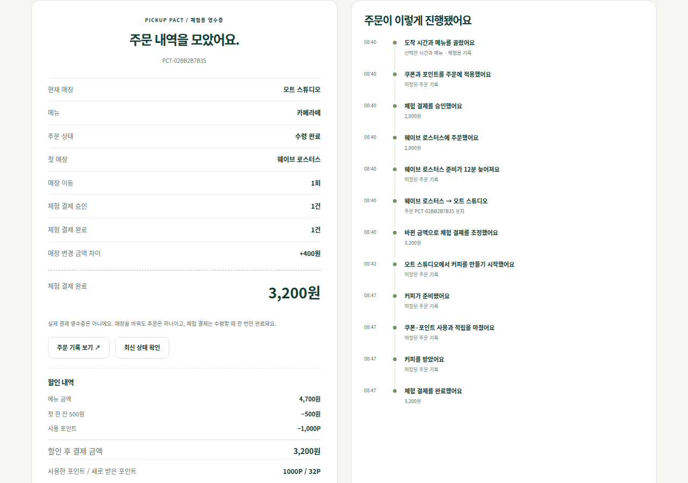
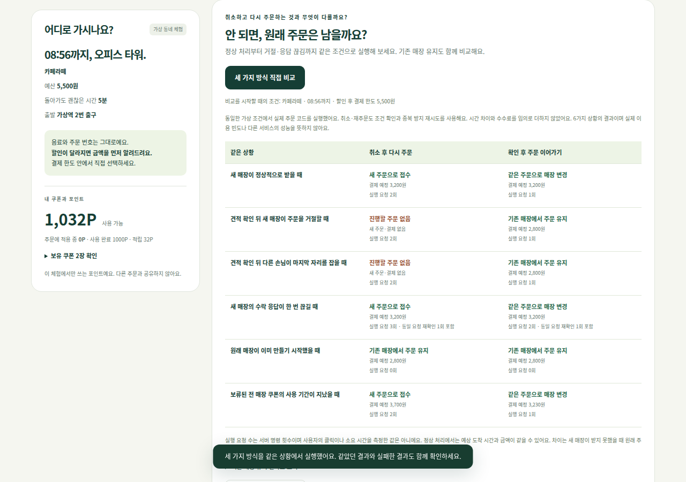
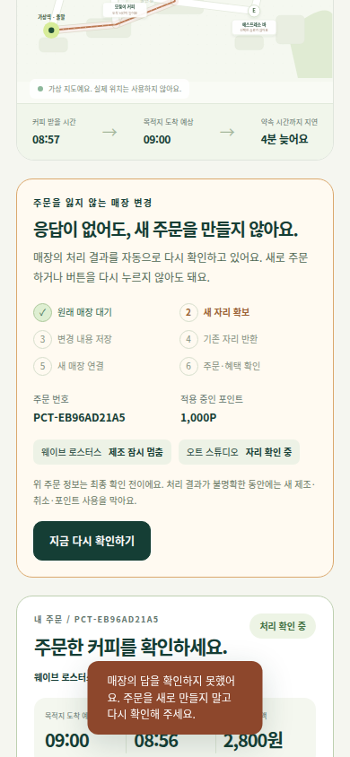
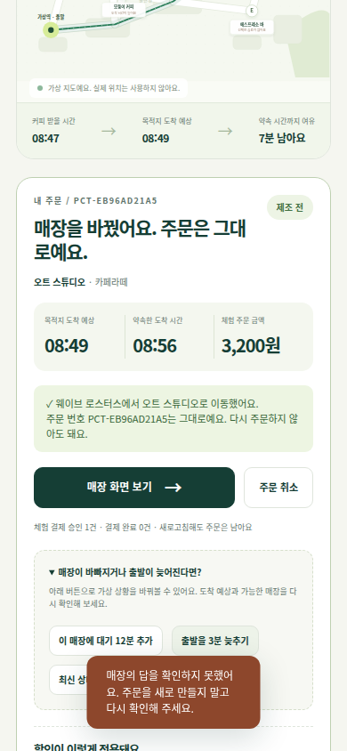

# Pickup Pact · 주문을 잃지 않는 매장 변경

**도착 마감에 맞는 카페를 고르고, 혼잡하면 같은 주문을 다른 매장으로 이어갑니다. 새 매장이 거절하면 원래 주문과 혜택을 유지하고, 응답이 끊기면 서버가 저장된 작업을 다시 확인합니다.**

[직접 체험하기](https://pickup-pact-demo.onrender.com) · [처리 순서와 실패 조건](docs/transfer-recovery.md) · [실행·촬영 검증 기록](docs/recovery-release-verification-2026-09-26.md) · [페이타랩 공고와 구현 대조](docs/jd-traceability.md)

## 데모 영상과 실제 화면

[](https://github.com/sokldjs554/pickup-pact/raw/refs/heads/main/docs/media/pickup-pact-demo.mp4)

**[약 40초 데모 영상](https://github.com/sokldjs554/pickup-pact/raw/refs/heads/main/docs/media/pickup-pact-demo.mp4)** · [촬영 원본·편집 기록](docs/media/capture.json)

쿠폰·1,000P 주문 → 새 매장 거절과 원래 주문 보존 → 수락 뒤 응답 끊김 → 다시 누르지 않아도 자동 복구 → 같은 주문의 수령·영수증 → 취소 후 재주문과 비교.

자동 복구와 매장 HTTP 통신이 켜진 공개 앱 `000a106cc5fda6a3be595a83f938087096c3ad63`를 실제 Chromium에서 촬영했습니다. 녹화 전후 `/health`가 일치하고 수동 `recover` 명령 없이 같은 주문이 복구됐습니다. 장면은 정상 속도이며, 장면 사이 대기와 가상 제조 시계 조작 일부만 생략했습니다. 최종 길이는 **39.72초**입니다. 자막은 원본 영상 시점에 맞춰 검토했고, 앱 화면이나 주문 결과를 편집으로 바꾸지 않았습니다.

**가상 매장·모의 결제입니다.** 실제 가맹점 장애를 일으키거나 카드 결제를 한 영상이 아닙니다. 이후 미디어 반영 커밋은 앱 코드가 같은지 따로 확인합니다.

| 새 매장 거절 | 응답 확인 중 | 자동 복구 후 같은 주문 |
|---|---|---|
|  |  |  |

<details>
<summary>주문·영수증·비교와 모바일 화면</summary>





 

</details>

## 고객이 직접 해보는 흐름

1. 목적지·도착 마감·음료 옵션·할인 후 결제 한도·허용 우회를 정합니다. 거리뿐 아니라 제조 대기와 목적지까지의 이동을 함께 계산합니다.
2. 주문한 매장을 혼잡하게 만든 뒤 다른 매장을 선택합니다. 음료 조건과 주문 번호는 유지하지만, 메뉴 가격과 쿠폰 조건이 달라지면 차액을 확인하고 동의해야 합니다.
3. 새 매장 거절이나 응답 끊김을 선택해 봅니다. 거절되면 원래 주문이 남고, 결과가 불명확하면 서버가 자동 재확인합니다. 마지막 자리에 다른 손님 주문을 먼저 넣는 상황도 같은 체험 회차에서 만들 수 있습니다.
4. 매장 화면에서 가상 제조 시계를 진행하고 수령 코드를 입력합니다. 한 주문의 변경 기록, 모의 결제와 포인트 사용·적립을 영수증에서 확인합니다.

현재 제품은 `/`와 `/go`, 이전 고객·매장 화면은 `/classic`, 고정 증거를 사용하는 취소·정산 확인 화면은 `/repair-lab`입니다. 서로 같은 주문 저장소를 쓰는 화면이라고 설명하지 않습니다.

## 실패했을 때 지키는 것

| 상황 | 처리 |
|---|---|
| 새 매장 거절·마지막 자리 선점 | 기존 주문부터 취소하지 않고 원래 주문·혜택을 유지합니다. |
| 매장에서 저장한 뒤 응답만 끊김 | 실패라고 단정하지 않고 같은 작업 ID로 저장된 결과를 확인합니다. |
| 변경 결정을 저장하기 전에 기한 경과 | 중단 결정을 저장하고 보류 해제·원래 주문 재개를 확인합니다. |
| COMMIT 결정 뒤 지연 | 시간만 보고 되돌리지 않고 기존 자리 반환·새 매장 인계를 이어갑니다. |
| 반복 확인 한도 초과 | 추가 확인 대상으로 남깁니다. 임의로 제조를 재개하거나 혜택을 풀지 않습니다. |
| 수령·혜택 요청 반복 | 모의 결제 확정과 포인트 사용·적립은 한 번만 기록합니다. |

공개 제품은 **주문 DB와 매장별 독립 SQLite DB**, 별도 매장 HTTP 프로세스, 서버 복구 작업자로 구성됩니다. 단계별 효과와 처리 영수증을 저장해 중단 후 이어갑니다. 매장 프로세스가 종료되면 같은 저장소와 포트로 재시작합니다. 브라우저는 상태를 조회하며, 페이지가 열려 있어야만 복구되는 구조는 아닙니다.

확인 중에는 제조 가능한 매장이 잠시 0곳이 되거나 두 매장의 자리를 점유할 수 있습니다. 모든 장애에서 즉시 성공하는 설계가 아니라, 중복 제조보다 일시적인 대기를 선택한 구현입니다. 한 호스트의 별도 프로세스이며 실제 가맹점·멀티 호스트 고가용성 운영을 뜻하지 않습니다.

[단계별 처리](demo/route/durable_operations.py) · [독립 매장 저장소](demo/route/merchant_fleet.py) · [HTTP 통신](demo/route/merchant_http.py) · [자동 복구](demo/route/recovery_worker.py) · [실행·재시작](demo/route/runtime.py)

## 쿠폰·포인트와 동일 조건 비교

쿠폰 1장과 포인트를 적용하고, 주문 시 보류·제조 전 취소 시 복원·수령 시 사용 확정과 적립을 처리합니다. 체험 지갑은 일정마다 독립적이며 실제 회원 자산이 아닙니다.

대표 영상의 전 매장 500원 쿠폰·1,000P 주문은 웨이브에서 2,800원, 오트에서 3,200원입니다. 이 **400원은 메뉴 차액**이며 쿠폰과 포인트 사용분은 유지됩니다. 수령 후 3,200원 모의 결제 1건, 1,000P 사용·32P 적립이 남습니다. 매장 전용 쿠폰을 고르면 이동 시 그 쿠폰을 못 쓸 수 있어, 할인 상실과 최종 차액을 별도로 안내합니다. 시간이 흘렀다고 추가 수수료를 받는 기능은 아닙니다.

비교는 서로 다른 두 종류입니다.

- **6개 상황의 실행 비교:** 기존 매장 유지·취소 후 재주문·확인 후 같은 주문 변경을 같은 명령 처리기로 실행합니다. 정상 처리나 응답 재시도에서 같았던 결과도 남깁니다. 차이는 새 매장 거절·자리 선점 시 원래 주문이 남는지입니다. 실행 요청 수는 클릭 수나 소요 시간을 측정한 값이 아닙니다.
- **기존 합성 도착 시간 실험:** 시드별 120건에서 이동·혼잡·예산·혜택·미래 지연을 같은 조건으로 비교합니다. 3개 시드 360건에서 마감 충족은 유지 82건, 이동 135건이었으며 악화 1건과 최초 주문 불가 72건도 포함합니다. 실제 고객 성과나 상용 앱의 알고리즘 비교가 아닙니다.

재주문 방식도 새 자리를 취소 전에 보장하면 주문 유실을 줄일 수 있습니다. 이를 독점적인 기술이나 모든 경쟁 서비스에 대한 우위로 주장하지 않습니다. 비교가 실행되는 동안 내 주문은 계속 이용할 수 있고, 결과 위에 비교를 시작한 시점의 조건을 표시합니다.

[혜택 정책·실험 가정](docs/benefits-and-outcomes.md) · [세 정책 비교](demo/route/transfer_comparison.py) · [공개 비교 화면 수정](docs/public-recovery-review-2026-09-26.md)

## 실행과 검증

Python 3.12 이상을 사용합니다. 실제 모델 API 키나 결제 키는 필요하지 않습니다.

```bash
python -m pip install -r demo/requirements.txt
python -m uvicorn demo.main:app --host 127.0.0.1 --port 10000
```

Windows PowerShell에서도 같은 실행 명령을 사용합니다. `GET /api/route/runtime`에서 `merchant_transport: http`와 자동 복구 활성화를 확인합니다. `ROUTE_DB`로 주문 DB 경로를 지정할 수 있습니다. 무료 Render의 임시 디스크는 재배포·인스턴스 교체 후 사라질 수 있으며, DB 유실을 복구한다고 주장하지 않습니다.

```bash
# Windows PowerShell: $env:PYTHONPATH=".;services/reconciler"
PYTHONPATH=.:services/reconciler python -m pytest -q tests/route services/reconciler/tests demo/test_demo.py demo/test_repair_integration.py
node scripts/verify_recovery_ui.cjs
node scripts/verify_handoff_labels.cjs
node scripts/verify_comparison_ui.cjs
python scripts/run_transfer_comparison.py --repeat 3
python scripts/verify_handoff_http.py --repeat 3
python -m pip install playwright
python -m playwright install chromium
python scripts/verify_handoff_browser.py --repeat 3
```

`route-product`는 Python을 3회 반복하고 복구·주문·혜택·문구 브라우저 흐름을 데스크톱/모바일 각각 3회 실행합니다. main에서는 정확한 공개 배포 SHA와 HTTP·자동 복구 런타임을 확인한 뒤 다시 검사합니다. 소스·커밋·로그·결과·캡처를 같은 실행 artifact에 보관합니다. 이전 커밋의 성공을 새 배포의 성공으로 대신하지 않습니다.

## 별도로 검증한 주문·취소·정산 서비스

새 제품과 별도로 **Kotlin/Spring WebFlux의 예약·용량, Java/Spring의 Merchant Fulfillment·Financial Ledger, Python/FastAPI Reconciler, PostgreSQL·Redis·Kafka와 Flask 운영 콘솔**을 유지합니다. 공개 새 주문 UI가 이 JVM·Kafka 전체 구성을 호출하는 것은 아닙니다.

- Merchant Fulfillment가 확정 주문의 취소와 제조 시작을 같은 상태 경계에서 판단합니다. 승인된 취소가 전달되면 commitment와 용량을 정리합니다.
- 원전표 ID와 남은 잔액으로 부분·복수 정산 역분개를 검사합니다. 원전표가 없는 과거 역분개는 임의로 배분하지 않습니다.
- 증거 누락·충돌이 있으면 자동 복구를 기다리거나 차단합니다. PostgreSQL projection은 이미 반영한 이벤트 ID와 내용 근거를 빠뜨린 갱신을 거절합니다.
- `/repair-lab`은 고정 합성 증거와 승인 기록을 사용합니다. 실제 환불이나 Java Ledger 호출을 하는 화면이 아닙니다. POS·알림은 중복 없는 의도 기록이며 실물 장치의 정확히 한 번 실행을 주장하지 않습니다.

복구 엔진의 기존 비교는 13개 합성 상황 × 5개 입력 순서입니다. 원본은 25/65, 별도 보수적 기준과 수정 엔진은 각각 65/65로 **동률**입니다. 65종 실운영 사고나 실제 환불 피해율로 설명하지 않습니다.

```bash
PYTHONPATH=.:services/reconciler python -m scripts.repair_audit.run --output comparison.json
mvn -B -DskipTests=false test
# 준비된 로컬 Docker 검증 환경에서만 실행
PYTHONPATH=.:services/reconciler python scripts/verify_upgrade_boundaries.py --passes 2
```

`ci`와 `release-gate`는 JVM·배포 이미지·전체 Docker 구성 2회·기존 데이터 경계·PostgreSQL 실행계획·Terraform 검증을 따로 수행합니다. 인프라 템플릿의 존재나 문법 검증을 실제 AWS·Kubernetes·Jenkins·Datadog·Elastic APM 운영 경력으로 설명하지 않습니다. n8n/Make·Slack/Jira/Notion 예시도 실제 팀 협업 경험의 증거는 아닙니다.

[취소·정산 작업대](docs/repair-workbench.md) · [아키텍처](docs/architecture.md) · [SQL·성능 검증](docs/performance.md) · [공고 대조](docs/jd-traceability.md) · [최신 앱·촬영 검증](docs/recovery-release-verification-2026-09-26.md)
