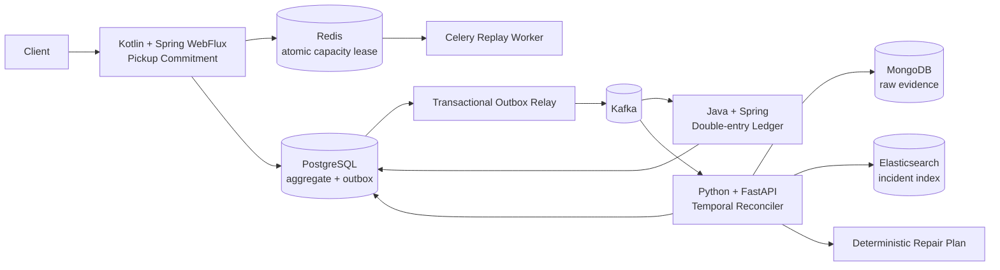

# Pickup Pact

**고객이 원하는 픽업 시간을 직접 고르는 스마트오더에서, 미래 제조 capacity를 5분 슬롯 자원으로 예약하고 주문·결제·취소·수령·정산·적립까지 그 약속의 정합성을 유지하는 이벤트 기반 백엔드 프로젝트입니다.**

**Live Demo:** <https://pickup-pact-demo.onrender.com>  
**Public demo engine:** `services/reconciler/app/engine.py` · 합성 데이터만 사용

### 핵심 문제

단순히 `pickup_at=12:30`을 저장하면 여러 고객이 동시에 같은 시간을 선택할 때 매장이 실제로 처리할 수 있는 양보다 많은 주문을 확정할 수 있습니다. Pickup Pact는 **메뉴별 제조 부담을 capacity unit으로 환산하고, (매장, 5분 슬롯)의 미래 capacity를 Redis Lua로 원자 예약**합니다. 주문 전에는 남은 용량을 조회해 고객이 가능한 시간 중 원하는 슬롯을 직접 고르고, 취소/수령 뒤에는 같은 lease를 여러 번 해제해도 용량이 과반환되지 않도록 lease identity를 별도로 보존합니다.

### 대표 장애 시나리오

고객이 **12:14:10에 9,000원짜리 12:30 픽업 주문을 취소**했지만 취소 메시지가 52초 늦게 도착합니다. 그 사이 점주 정산 9,000원과 고객 포인트 90P가 먼저 반영됩니다.

Pickup Pact는 서버가 받은 순서만 믿지 않고 `occurred_at`과 `received_at`을 분리합니다. 그 결과 **취소가 실제로 정산보다 먼저 발생했다는 사실을 복원하고, 기존 금전 이력을 삭제하지 않은 채 정산 reversal과 포인트 회수 계획을 생성**합니다.

이 주제를 선택한 이유는 주문/결제/정산/적립 같은 비즈니스 로직, Kafka 기반 비동기 처리, CQRS, Redis, 분산 트랜잭션과 데이터 정합성, 장애 추적이라는 페이타랩 백엔드 공고의 핵심 문제와 직접 연결되면서도 흔한 주문 CRUD/음식배달 MSA 클론과 다른 문제를 보여주기 위해서입니다.

## 공개 데모: 손님용 스마트오더와 개발자 콘솔을 분리

공개 URL의 기본 화면은 **가상 손님이 직접 사용하는 스마트오더 서비스**입니다. 개발자 콘솔이나 복구 시스템은 손님 화면에 노출하지 않습니다.

### 손님용 스마트오더

가상 매장과 메뉴를 실제 데모 API에서 불러옵니다. 방문자는 아래 흐름을 직접 눌러볼 수 있습니다.

1. **매장 선택** — 근처 가상 카페 3곳 중 하나를 고릅니다.
2. **메뉴 담기** — 아메리카노, 라떼, 샌드위치 등을 장바구니에 담습니다.
3. **수량 변경 / 금액 확인** — 장바구니에서 수량과 총 금액이 실제로 바뀝니다.
4. **픽업 시간 선택** — 메뉴별 제조 부담을 합산해 현재 주문이 들어갈 수 있는 5분 슬롯을 조회하고, 고객이 가능한 시간 중 하나를 직접 선택합니다.
5. **주문하기** — 선택한 슬롯 capacity를 HOLD한 뒤 주문 생성 → 결제 승인 → 픽업 확정 API를 호출합니다.
6. **주문 상태 확인** — 주문 접수 → 준비 중 → 픽업 준비 상태를 `내 주문`에서 확인합니다.
7. **픽업 약속 보호** — 확정 이후 머신 장애처럼 처리량이 줄면 capacity risk를 감지하고 새 시간을 제안합니다. 고객이 수락하면 `PickupRescheduled` 이벤트와 감사 기록이 남습니다.
8. **1회용 픽업 코드** — 픽업 준비가 되면 이름/전화번호 대신 주문별 4자리 코드를 보여줍니다. 정상 수령 시 `PickupClaimed`가 기록되고 같은 코드는 다시 사용할 수 없습니다.
9. **Trust Receipt + 주문 내역** — 픽업 완료/취소 주문은 이력에 남고, 모바일 영수증에서 주문·결제·픽업시간 변경·취소 정리·최종 청구·포인트 결과를 한 번에 확인합니다.
10. **주문 취소** — 손님은 단순한 취소 완료 화면만 봅니다. 데모 내부에서는 취소 메시지 지연과 잘못된 정산/포인트 상황을 재현하고 reconciliation + compensating repair를 자동 실행해 최종 순액을 0으로 맞춥니다.

일반 사용자는 Kafka, CQRS, ledger, anomaly, repair command 같은 용어를 볼 필요가 없습니다. 해당 내용은 백엔드 검토용 **숨김 개발자 모드(`?dev=1`)** 에서만 확인합니다.

이 프로젝트의 제품 차별점은 **User-selected Capacity Slot + Pickup Promise Recovery + Trust Receipt + One-time Pickup Code**입니다. 정상 주문뿐 아니라 매장 처리량·이벤트 지연·중복·취소·수령 확인 문제가 생겨도 고객에게는 필요한 다음 행동만 보여주고, 백엔드에는 정합성·ledger·audit 근거를 보존합니다.

### 기술 상세

백엔드 면접관이나 개발자는 같은 세션에서 아래 운영 도구로 더 깊게 들어갈 수 있습니다.

- **주문 흐름**: HOLD 주문, 결제 승인, 픽업 확정, 취소, 정상 정산/적립
- **매장 처리량**: reserved/available units, capacity revision, `AT_RISK`
- **장애 주입**: 52초 지연 취소, exact Kafka redelivery, 동일 `event_id` 금액 충돌, 처리량 감소
- **정합성 복구**: 실제 `services/reconciler/app/engine.py`, receive-time vs business-time, anomaly/evidence/repair proposal
- **정산 · 감사**: settlement/reward/reversal ledger, net balance, projection rebuild, audit trail

각 브라우저는 독립적인 demo session을 사용해 다른 방문자의 상태와 섞이지 않습니다. 공개 Render 인스턴스는 리뷰 편의를 위해 FastAPI + session-isolated in-memory sandbox로 동작합니다. Kafka/PostgreSQL/Redis/MongoDB/Elasticsearch 전체 topology가 공개 인스턴스에서 함께 실행된다고 주장하지 않습니다.

대표 기술 흐름은 다음과 같습니다.

```text
정상 주문 확정
  → 취소 메시지 52초 지연
  → 그 사이 점주 정산 + 포인트 적립
  → reconciliation
  → REVERSE_SETTLEMENT + REVERSE_REWARD
  → 샌드박스에 보상 계획 적용
  → net settlement 0 / reward balance 0
```

로컬 실행:

```bash
pip install -r demo/requirements.txt
pytest -q demo/test_demo.py
uvicorn demo.main:app --host 0.0.0.0 --port 10000

# 공개 데모와 같은 이미지
docker build -f Dockerfile.demo -t pickup-pact-demo .
docker run --rm -p 10000:10000 pickup-pact-demo
```

## 핵심 설계



### 시스템 불변식

- 고객은 주문 전에 **5분 단위 capacity-aware pickup slot**을 조회하고 가능한 시간 중 원하는 시간을 선택합니다.
- 픽업 확정에는 **capacity lease + payment authorization**이 모두 필요합니다.
- Redis Lua 경로에서는 동일 슬롯의 제조 capacity를 원자적으로 초과할 수 없습니다.
- lease identity를 별도 Redis key로 저장해 취소/수령 API가 재시도되어도 같은 capacity를 두 번 반환하지 않습니다.
- 같은 `event_id` + 같은 semantic fingerprint는 안전한 재전달로 간주해 financial side effect를 다시 만들지 않습니다.
- 같은 `event_id` + 다른 fingerprint는 조용히 dedupe하지 않고 `ledger_conflicts`에 근거를 격리해 조회할 수 있습니다.
- 취소가 뒤늦게 도착해도 이미 기록한 회계 이력을 삭제하지 않고 **compensating entry**를 생성합니다.
- canonical state는 수신 순서가 아니라 business occurrence time과 근거 이벤트에서 재구성합니다.
- AI는 사고 설명·테스트 생성·리뷰를 도울 수 있지만 금전 repair command를 직접 실행하지 못합니다.

## 공고 스택 → 실제 구현

| 공고 기술 | 프로젝트에서 맡은 역할 |
|---|---|
| Kotlin / Spring WebFlux | Pickup Commitment aggregate와 reactive API |
| Java / Spring | 이중 분개 Ledger, semantic idempotency, 충돌 quarantine, 주문별 ledger history 조회 |
| Python / FastAPI | event-time reconciliation engine, 공개 데모 API |
| Flask | 원본 ops-console 구현 경로의 운영 콘솔; 공개 데모는 배포 단순화를 위해 FastAPI 단일 프로세스로 구성 |
| PostgreSQL | commitment, transactional outbox, ledger, reconciliation audit |
| MongoDB | 재생 가능한 raw event evidence archive |
| Redis | Lua 기반 atomic capacity lease + Celery broker |
| Elasticsearch | incident 검색/포렌식 index |
| Kafka | commitment/financial domain events |
| Celery | 비동기 replay worker와 retry/backoff |
| DDD / EDA / CQRS | bounded context, domain event, explicit canonical projection rebuild/query API |
| Docker / Kubernetes | 서비스 이미지, Compose, K8s deployment |
| AWS | RDS PostgreSQL · ElastiCache Redis · MSK Serverless Terraform blueprint |
| Jenkins | JVM/Python/Docker 검증 pipeline |
| Datadog / Elastic APM | anomaly monitor와 cross-service trace contract |
| Claude Code / Cursor | `CLAUDE.md`, `.cursor/rules/project.mdc` |
| ChatGPT / Claude / Gemini | provider-neutral incident review prompt/eval contract |
| n8n / Make | CI regression triage automation template |
| Slack / Jira / Notion | 자동화의 선택적 destination; 실제 계정 연동을 했다고 주장하지 않음 |
| REST / OpenAPI / AsyncAPI | commitment tracking, ledger posting/history/conflict, reconciliation HTTP 및 event contract |

상세 매핑: [docs/jd-traceability.md](docs/jd-traceability.md)

## 검증된 합성 실험

초기 로컬 구현에서 seed 42로 **20,000 orders / 101,588 events**를 생성해 단순 receive-order 처리와 정합성 모델을 비교했습니다.

| correctness fault | naive | Pickup Pact model |
|---|---:|---:|
| capacity oversubscribed units | 194 | **0** |
| duplicate financial posts | 1,207 | **0** |
| late-cancel stale financial orders | 381 | **0** |
| deterministic repair commands | - | 762 |

5개 seed 총 100,000 orders에서도 세 오류 유형은 모델 경로에서 0이었습니다. 원본 결과는 [artifacts/consistency-benchmark.json](artifacts/consistency-benchmark.json), [artifacts/consistency-matrix.json](artifacts/consistency-matrix.json)에 보존했습니다.

**이 수치는 합성 correctness 실험이며 production TPS/SLA 주장이 아닙니다.**

## Pickup Policy Lab — 차별점 검증

`scripts/pickup_policy_lab.py`는 같은 합성 주문 20,000건을 **stale snapshot admission**과 **capacity-aware admission**에 각각 replay합니다.

| 정책 결과 | Baseline | Pickup Pact |
|---|---:|---:|
| baseline admitted / offerable within window | 19,751 | 20,000 |
| baseline rejected / no feasible slot | 249 | 0 |
| overbooked slots | 96 | 0 |
| oversubscribed units | 213 | 0 |
| later-slot re-offers required | — | 532 |

Pickup Pact의 0 overbooking은 공짜가 아닙니다. 이 workload에서는 532건이 선택 슬롯에 바로 들어가지 못해 다음 가능한 5분 슬롯을 고객에게 다시 제안해야 했습니다. 따라서 포트폴리오에서는 **“항상 더 빠르다”가 아니라 “약속할 수 없는 시간을 과예약하지 않고, 필요하면 사용자에게 다음 가능한 시간을 제시한다”**는 trade-off로 설명합니다.

이 결과는 결정적 합성 policy replay이며 실제 패스오더 주문량·매출·SLA를 의미하지 않습니다. 원본: [artifacts/pickup-policy-lab.json](artifacts/pickup-policy-lab.json)

## 저장소 구조

```text
demo/                         # 면접관용 FastAPI 운영 샌드박스 + session state
services/
  commitment-service/         # Kotlin + Spring WebFlux
  ledger-service/             # Java + Spring
  reconciler/                 # Python + FastAPI + Celery
contracts/                    # OpenAPI / AsyncAPI
sql/                          # PostgreSQL schema
infra/
  k8s/                        # Kubernetes
  aws/terraform/              # RDS / ElastiCache / MSK blueprint
  observability/              # Datadog / Elastic APM
automation/                   # n8n / Make
ai/                           # incident triage prompt + eval cases
artifacts/                    # measured synthetic evidence
```

## 개발/검증

Fast path:

```bash
# interviewer demo
pip install -r demo/requirements.txt
pytest -q demo/test_demo.py
uvicorn demo.main:app --host 0.0.0.0 --port 10000
```

Core checks:

```bash
pip install -e "services/reconciler[dev]"
pytest -q services/reconciler/tests
mvn -B test
```

Full local topology:

```bash
cp .env.example .env
docker compose up --build
```

GitHub Actions는 Python reconciler, interviewer demo tests/live smoke, Docker build, Kotlin/Java Maven tests, OpenAPI/AsyncAPI parse, Terraform validate를 검증합니다. Jenkinsfile도 같은 핵심 검증 경계를 사용합니다.

## 왜 이 주제인가

공개 주문 백엔드 포트폴리오는 `order/payment/restaurant + Kafka + Saga/Outbox/CQRS` 조합이 이미 매우 흔합니다. Pickup Pact는 여기에 기술을 더 붙이는 대신 **사용자가 고른 미래 픽업 시간을 실제 제조 capacity와 충돌 없이 예약하는 문제**를 먼저 도메인 자원으로 모델링하고, 확정 이후에는 이벤트 지연·중복·취소·capacity 변화까지 같은 약속의 수명주기로 연결합니다.

특정 회사의 비공개 시스템을 추정하거나 복제하지 않았습니다. 공개 채용 요구와 일반적인 스마트오더 장애 조건에서 독립적으로 설계했습니다.

자세한 선택 근거: [docs/topic-research.md](docs/topic-research.md)

## 범위와 한계

- 실제 고객·점주·결제 데이터는 사용하지 않았습니다.
- AWS/Kubernetes/Datadog/Elastic APM 설정은 실행 가능한 배포/관측 blueprint이며, 별도 실행 증거가 없는 외부 운영 환경을 실제 운영했다고 표현하지 않습니다.
- Slack/Jira/Notion/n8n/Make는 integration artifact이며 실제 SaaS 계정 연결을 주장하지 않습니다.
- 공개 데모는 빠른 검토를 위해 FastAPI 단일 프로세스로 배포하지만, anomaly/repair 계산은 실제 `services/reconciler/app/engine.py`를 사용합니다. 전체 Kafka/PostgreSQL/Redis/MongoDB/Elasticsearch topology가 공개 데모에서 함께 기동된다고 주장하지 않습니다.
- AI 결과는 advisory-only이고 정산·포인트·환불 repair는 deterministic boundary에서만 생성합니다.

## License

All rights reserved. 별도의 오픈소스 라이선스를 부여하지 않습니다.
