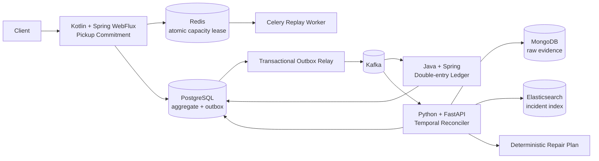

# Pickup Pact

**스마트오더에서 늦은 취소·중복 메시지·매장 처리량 변화 때문에 주문/정산/적립 상태가 어긋났을 때, 실제 업무 발생 순서를 복원해 안전한 복구 계획을 만드는 백엔드 프로젝트입니다.**

**Live Demo:** <https://pickup-pact-demo.onrender.com>  
**Public demo engine:** `services/reconciler/app/engine.py` · 합성 데이터만 사용

### 대표 시나리오

고객이 **12:14:10에 9,000원짜리 12:30 픽업 주문을 취소**했지만 취소 메시지가 52초 늦게 도착합니다. 그 사이 점주 정산 9,000원과 고객 포인트 90P가 먼저 반영됩니다.

Pickup Pact는 서버가 받은 순서만 믿지 않고 `occurred_at`과 `received_at`을 분리합니다. 그 결과 **취소가 실제로 정산보다 먼저 발생했다는 사실을 복원하고, 기존 금전 이력을 삭제하지 않은 채 정산 reversal과 포인트 회수 계획을 생성**합니다.

이 주제를 선택한 이유는 주문/결제/정산/적립 같은 비즈니스 로직, Kafka 기반 비동기 처리, CQRS, Redis, 분산 트랜잭션과 데이터 정합성, 장애 추적이라는 페이타랩 백엔드 공고의 핵심 문제와 직접 연결되면서도 흔한 주문 CRUD/음식배달 MSA 클론과 다른 문제를 보여주기 위해서입니다.

## 면접관용 데모

공개 데모는 더 이상 네 개의 고정 시나리오만 보여주는 화면이 아닙니다. **한 세션 안에서 주문을 만들고, 결제를 승인하고, 픽업을 확정하고, 장애를 직접 주입하고, 정합성 엔진으로 원인을 분석한 뒤, 보상 계획을 샌드박스에 적용하는 운영 콘솔**입니다.

### 실제로 조작할 수 있는 기능

1. **개요 Dashboard**
   - 현재 주문 상태, 이벤트 수, 탐지된 이상 수, ledger batch 수
   - 늦은 취소 / Kafka 중복 / capacity 감소 / event-id 금액 충돌 preset
2. **주문 흐름**
   - 새 HOLD 주문 생성
   - 별도 payment authorization
   - pickup confirmation
   - 정상 cancellation
3. **매장 처리량**
   - 현재 slot의 reserved / available units 확인
   - capacity revision 이벤트 발행
   - 확정 주문을 `AT_RISK`로 만드는 상황 재현
4. **장애 주입 Lab**
   - 52초 늦게 도착하는 취소
   - exact Kafka redelivery
   - 같은 `event_id` + 다른 금액
   - 픽업 약속보다 작은 매장 처리량
5. **정합성 복구**
   - 실제 `services/reconciler/app/engine.py` 호출
   - 서버 수신 순서와 실제 업무 발생 순서 비교
   - anomaly / evidence / deterministic repair proposal 확인
   - 안전한 repair plan을 **데모 샌드박스에만** 적용
6. **정산 · 감사**
   - settlement / reward / reversal ledger batch
   - net settlement / reward balance
   - projection rebuild 횟수
   - operator audit trail

각 브라우저는 독립적인 demo session을 사용해 다른 방문자의 상태와 섞이지 않습니다.

대표 흐름은 다음과 같습니다.

```text
HOLD 주문 생성
  → 결제 승인
  → 픽업 확정
  → 취소 메시지 52초 지연
  → 그 사이 점주 정산 + 포인트 적립
  → reconciliation
  → REVERSE_SETTLEMENT + REVERSE_REWARD
  → 샌드박스에 보상 계획 적용
  → net settlement 0 / reward balance 0
```

공개 Render 인스턴스는 리뷰 편의를 위해 FastAPI + session-isolated in-memory sandbox로 동작합니다. Kafka/PostgreSQL/Redis/MongoDB/Elasticsearch 전체 topology가 공개 인스턴스에서 함께 실행된다고 주장하지 않습니다. 실제 분산 서비스 구현과 계약, Compose/Kubernetes/Terraform은 저장소의 별도 서비스 경로에 있습니다.

로컬 실행:

```bash
pip install -r demo/requirements.txt
pytest -q demo/test_demo.py
uvicorn demo.main:app --host 0.0.0.0 --port 10000

# 공개 데모와 같은 이미지
docker build -f Dockerfile.demo -t pickup-pact-demo .
docker run --rm -p 10000:10000 pickup-pact-demo
```

## 핵심 설계



### 시스템 불변식

- 픽업 확정에는 **capacity lease + payment authorization**이 모두 필요합니다.
- Redis Lua 경로에서는 동일 슬롯의 제조 capacity를 원자적으로 초과할 수 없습니다.
- 같은 `event_id` + 같은 semantic fingerprint는 안전한 재전달로 간주해 financial side effect를 다시 만들지 않습니다.
- 같은 `event_id` + 다른 fingerprint는 조용히 dedupe하지 않고 `ledger_conflicts`에 근거를 격리해 조회할 수 있습니다.
- 취소가 뒤늦게 도착해도 이미 기록한 회계 이력을 삭제하지 않고 **compensating entry**를 생성합니다.
- canonical state는 수신 순서가 아니라 business occurrence time과 근거 이벤트에서 재구성합니다.
- AI는 사고 설명·테스트 생성·리뷰를 도울 수 있지만 금전 repair command를 직접 실행하지 못합니다.

## 공고 스택 → 실제 구현

| 공고 기술 | 프로젝트에서 맡은 역할 |
|---|---|
| Kotlin / Spring WebFlux | Pickup Commitment aggregate와 reactive API |
| Java / Spring | 이중 분개 Ledger, semantic idempotency, 충돌 quarantine, 주문별 ledger history 조회 |
| Python / FastAPI | event-time reconciliation engine, 공개 데모 API |
| Flask | 원본 ops-console 구현 경로의 운영 콘솔; 공개 데모는 배포 단순화를 위해 FastAPI 단일 프로세스로 구성 |
| PostgreSQL | commitment, transactional outbox, ledger, reconciliation audit |
| MongoDB | 재생 가능한 raw event evidence archive |
| Redis | Lua 기반 atomic capacity lease + Celery broker |
| Elasticsearch | incident 검색/포렌식 index |
| Kafka | commitment/financial domain events |
| Celery | 비동기 replay worker와 retry/backoff |
| DDD / EDA / CQRS | bounded context, domain event, rebuildable projection |
| Docker / Kubernetes | 서비스 이미지, Compose, K8s deployment |
| AWS | RDS PostgreSQL · ElastiCache Redis · MSK Serverless Terraform blueprint |
| Jenkins | JVM/Python/Docker 검증 pipeline |
| Datadog / Elastic APM | anomaly monitor와 cross-service trace contract |
| Claude Code / Cursor | `CLAUDE.md`, `.cursor/rules/project.mdc` |
| ChatGPT / Claude / Gemini | provider-neutral incident review prompt/eval contract |
| n8n / Make | CI regression triage automation template |
| Slack / Jira / Notion | 자동화의 선택적 destination; 실제 계정 연동을 했다고 주장하지 않음 |
| REST / OpenAPI / AsyncAPI | commitment tracking, ledger posting/history/conflict, reconciliation HTTP 및 event contract |

상세 매핑: [docs/jd-traceability.md](docs/jd-traceability.md)

## 검증된 합성 실험

초기 로컬 구현에서 seed 42로 **20,000 orders / 101,588 events**를 생성해 단순 receive-order 처리와 정합성 모델을 비교했습니다.

| correctness fault | naive | Pickup Pact model |
|---|---:|---:|
| capacity oversubscribed units | 194 | **0** |
| duplicate financial posts | 1,207 | **0** |
| late-cancel stale financial orders | 381 | **0** |
| deterministic repair commands | - | 762 |

5개 seed 총 100,000 orders에서도 세 오류 유형은 모델 경로에서 0이었습니다. 원본 결과는 [artifacts/consistency-benchmark.json](artifacts/consistency-benchmark.json), [artifacts/consistency-matrix.json](artifacts/consistency-matrix.json)에 보존했습니다.

**이 수치는 합성 correctness 실험이며 production TPS/SLA 주장이 아닙니다.**

## 저장소 구조

```text
demo/                         # 면접관용 FastAPI 운영 샌드박스 + session state
services/
  commitment-service/         # Kotlin + Spring WebFlux
  ledger-service/             # Java + Spring
  reconciler/                 # Python + FastAPI + Celery
contracts/                    # OpenAPI / AsyncAPI
sql/                          # PostgreSQL schema
infra/
  k8s/                        # Kubernetes
  aws/terraform/              # RDS / ElastiCache / MSK blueprint
  observability/              # Datadog / Elastic APM
automation/                   # n8n / Make
ai/                           # incident triage prompt + eval cases
artifacts/                    # measured synthetic evidence
```

## 개발/검증

Fast path:

```bash
# interviewer demo
pip install -r demo/requirements.txt
pytest -q demo/test_demo.py
uvicorn demo.main:app --host 0.0.0.0 --port 10000
```

Core checks:

```bash
pip install -e "services/reconciler[dev]"
pytest -q services/reconciler/tests
mvn -B test
```

Full local topology:

```bash
cp .env.example .env
docker compose up --build
```

GitHub Actions는 Python reconciler, interviewer demo tests/live smoke, Docker build, Kotlin/Java Maven tests, OpenAPI/AsyncAPI parse, Terraform validate를 검증합니다. Jenkinsfile도 같은 핵심 검증 경계를 사용합니다.

## 왜 이 주제인가

공개 주문 백엔드 포트폴리오는 `order/payment/restaurant + Kafka + Saga/Outbox/CQRS` 조합이 이미 매우 흔합니다. Pickup Pact는 패스오더를 복제하는 대신 **예약 픽업 약속이 이미 확정된 이후 발생하는 시간적 정합성 문제**를 중심에 둡니다.

특정 회사의 비공개 시스템을 추정하거나 복제하지 않았습니다. 공개 채용 요구와 일반적인 스마트오더 장애 조건에서 독립적으로 설계했습니다.

자세한 선택 근거: [docs/topic-research.md](docs/topic-research.md)

## 범위와 한계

- 실제 고객·점주·결제 데이터는 사용하지 않았습니다.
- AWS/Kubernetes/Datadog/Elastic APM 설정은 실행 가능한 배포/관측 blueprint이며, 별도 실행 증거가 없는 외부 운영 환경을 실제 운영했다고 표현하지 않습니다.
- Slack/Jira/Notion/n8n/Make는 integration artifact이며 실제 SaaS 계정 연결을 주장하지 않습니다.
- 공개 데모는 빠른 검토를 위해 FastAPI 단일 프로세스로 배포하지만, anomaly/repair 계산은 실제 `services/reconciler/app/engine.py`를 사용합니다. 전체 Kafka/PostgreSQL/Redis/MongoDB/Elasticsearch topology가 공개 데모에서 함께 기동된다고 주장하지 않습니다.
- AI 결과는 advisory-only이고 정산·포인트·환불 repair는 deterministic boundary에서만 생성합니다.

## License

All rights reserved. 별도의 오픈소스 라이선스를 부여하지 않습니다.
