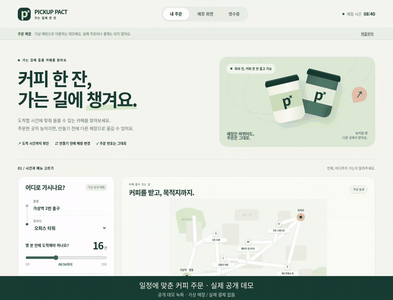
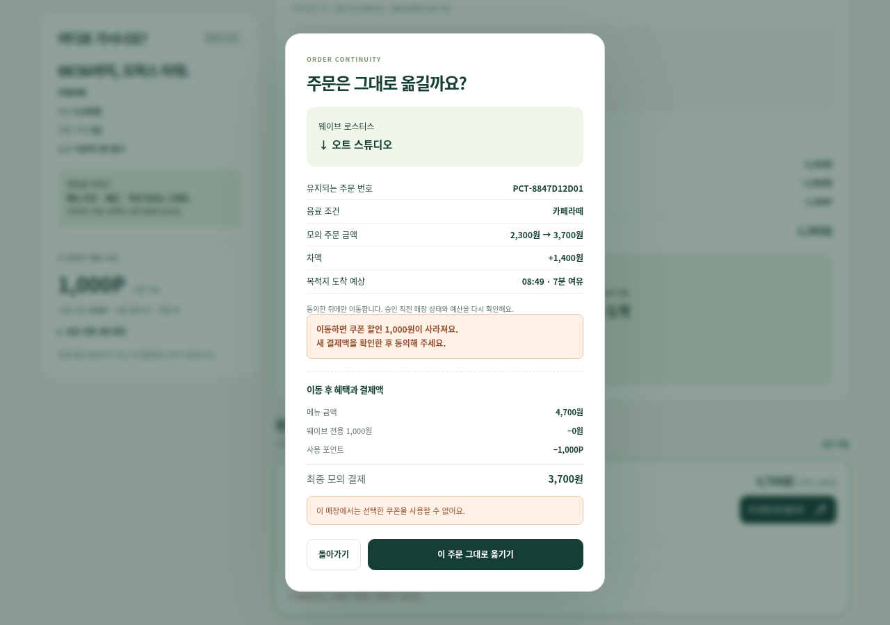
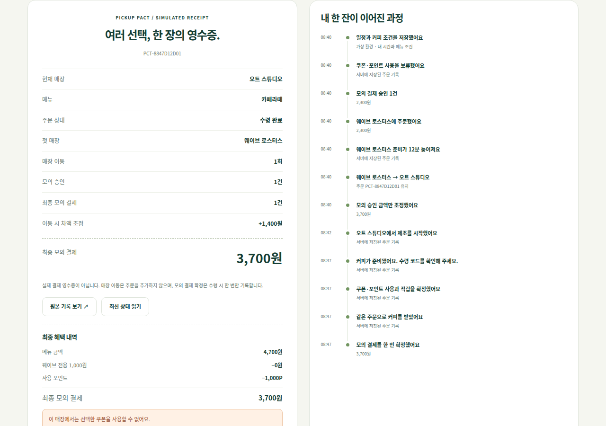
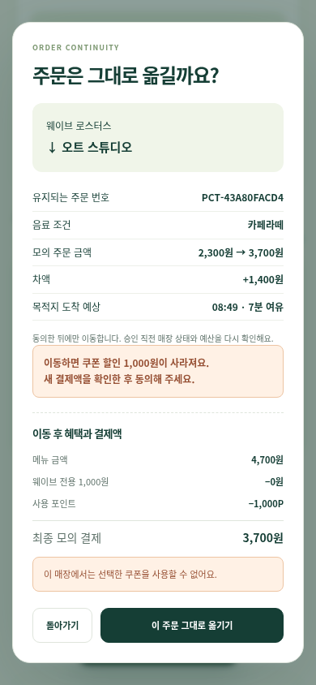
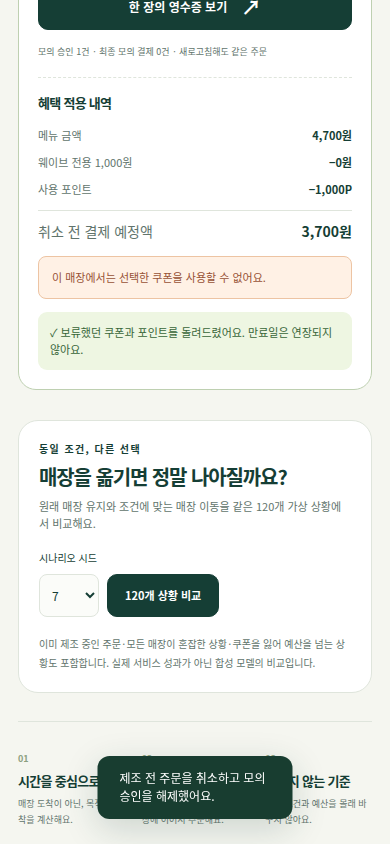

# Pickup Pact · 내 일정이 먼저인 커피 주문

**목적지 도착 마감에 맞춰 커피 경로를 찾고, 주문 매장이 혼잡해지면 제조 전에 같은 주문을 다른 매장으로 이어갑니다.**

현재 제품 화면은 `/`와 `/go`, 기존 주문·점주 화면은 `/classic`, 증거 복구 작업대는 `/repair-lab`입니다. 브랜치 변경이 배포됐는지는 `/health.release_commit`으로 확인합니다.

## 데모 영상과 실제 화면

[](https://github.com/sokldjs554/pickup-pact/raw/refs/heads/main/docs/media/pickup-pact-demo.mp4)

**[약 38초 영상 보기](https://github.com/sokldjs554/pickup-pact/raw/refs/heads/main/docs/media/pickup-pact-demo.mp4)** · [직접 체험](https://pickup-pact-demo.onrender.com)

전용 쿠폰·1,000P 적용 → 매장 혼잡 → 쿠폰 상실과 +1,400원 확인 → 고객 동의로 같은 주문 이동 → 수령·영수증.

실제 공개 사이트를 녹화했습니다. 장면 사이의 대기·제조 조작 일부를 잘랐으며, 표시되는 시간·포인트·결제는 가상 체험 값입니다. 촬영한 앱 버전: `baca06bc`. [촬영·검증 기록](docs/media/capture.json)

<details>
<summary>데스크톱·모바일 캡처 보기</summary>





 

</details>

## 쿠폰·포인트와 동일 조건 비교

첫 화면에서 전 매장/매장 전용/정률 쿠폰과 체험 포인트를 선택합니다. 매장 이동으로 할인이 사라지면 새로운 결제액을 확인하고 동의해야 합니다. 주문 때 혜택을 보류하고, 제조 전 취소 때 복원하며, 수령 때 한 번만 차감·적립합니다. 이 일정만의 모의 지갑이며 실제 회원 포인트가 아닙니다.

현재 주문의 예상 도착 시간·추가 결제액을 비교할 수 있습니다. 별도의 120건 동일 조건 정책 실험은 제조 시작·대체 매장 혼잡·쿠폰 상실·미래 지연과 양쪽 실패를 포함하고 시드별 원본을 제공합니다. 실제 서비스 성과가 아닌 합성 모델의 결과입니다. [정책·실험 설계·재현 방법](docs/benefits-and-outcomes.md)

## 새 제품에서 직접 하는 일

1. 목적지, 도착 마감, 음료·오트·디카페인 조건, 예산, 허용 우회를 정합니다.
2. 서버가 가상 이동 경로와 매장 대기를 함께 계산합니다. 조건에 맞지 않는 매장은 제외 이유를 보여줍니다.
3. 한 매장에 주문한 다음 혼잡을 증가시킵니다. 제조 전이라면 제안된 다른 매장으로 고객 동의를 거쳐 이동합니다.
4. 같은 주문 번호로 매장 제조 → 수령 코드 → 한 번의 모의 결제 → 영수증을 확인합니다.

거리순 선택과의 비교는 공개한 단순 기준 정책이지 패스오더의 실제 알고리즘이 아닙니다. 패스오더의 예약·같이 주문 기능은 차별점으로 주장하지 않습니다. [제품 설계 및 공개 자료 대조](docs/superpowers/specs/2026-09-24-time-first-coffee.md)

**실제 지도/GPS·가맹점·결제를 연결한 상용 서비스가 아닙니다.** 가상 출발지 고정, 합성 매장과 시계, SQLite 트랜잭션 기반의 동작하는 제품 실험입니다. 대체 매장은 현재 체험 시각과 고정 출발지에서 보수적으로 재계산하며 이동 중 실시간 위치 재탐색을 주장하지 않습니다. 시간은 모델 예상값이며 실제 도착 보장이 아닙니다. 제조가 시작됐거나 조건을 만족하는 매장이 없으면 이동을 거절합니다.

실행: `python -m pip install -r demo/requirements.txt` 다음 `python -m uvicorn demo.main:app --host 127.0.0.1 --port 10000`. Windows PowerShell은 동일한 명령을 사용합니다. 새 제품 DB는 `ROUTE_DB`로 설정하며 무료 Render 임시 디스크는 재배포 후 초기화될 수 있습니다.

새 검증: `PYTHONPATH=.:services/reconciler python -m pytest -q tests/route`. 실제 브라우저는 `python scripts/verify_route_browser.py --base-url http://127.0.0.1:10000 --repeat 3`. CI의 route-product는 기존 Python 검증을 함께 반복하고 desktop/mobile 고객-매장-영수증 전체 흐름을 실행합니다.

---

## 기존 정합성·복구 시스템

**주문 취소·정산 증거가 늦게 오거나 서로 모순될 때, 자동 복구를 허용할지·기다릴지·차단할지 판단하고 승인된 전표만 모의 원장에 기록하는 백엔드 검증 프로젝트입니다.**

[취소·정산 복구 작업대](https://pickup-pact-demo.onrender.com/repair-lab) · [기존 주문·매장 데모](https://pickup-pact-demo.onrender.com/classic) · [실행·검증 방법](docs/repair-workbench.md)

공개 주소의 현재 배포 커밋은 `/health`의 `release_commit`으로 확인합니다. PR 브랜치 변경은 병합·배포 전까지 공개 화면에 반영되지 않습니다.

## 먼저 확인할 범위

**실제 결제·환불을 실행하지 않습니다.** 공개 화면은 고정된 합성 주문을 사용하는 검증 환경입니다. 패스오더 운영 데이터·비공개 아키텍처·실제 지연 보상 정책을 재현했다고 주장하지 않습니다.

예약 픽업·제조 시점 관리·적립 기능 자체는 이미 상용 서비스에 있습니다. 이 저장소는 해당 기능의 시장 독창성이나 다른 지원자보다 우수함을 주장하지 않습니다. 무엇을 재현했고 어디서 잘못 판단했으며 어떤 조건에서 자동 처리를 거부하는지를 코드와 반복 실행 결과로 보여줍니다.

## 실제로 눌러보는 흐름

복구 작업대에서 **취소 전달 지연 → 계획 조회 → 전표·금액·단위 확인 → 승인 후 모의 기록 → 동일 승인 재전송**을 실행합니다.

정산 9,000 KRW와 주문 적립 90 PTS는 서로 다른 전표입니다. 승인 시점의 증거 버전·해시와 서버에 저장한 계획이 맞을 때만 두 모의 조치를 기록합니다. 승인 뒤 응답을 잃어 같은 요청을 보내도 기존 결과를 반환합니다.

| 샘플 상황 | 처리 |
|---|---|
| 확정 취소 뒤 정산·주문 적립 | 지원 범위와 증거가 맞으면 복구 계획 생성 |
| 원인 이벤트가 아직 미도착 | `WAIT_FOR_EVIDENCE`, 필요한 ID를 보여주고 조치 금지 |
| 같은 정산 ID에 다른 금액 | `MANUAL_REVIEW`, 충돌한 증거를 보존하고 조치 금지 |
| 취소 확정과 수령 완료가 모두 존재 | 시각으로 승자를 정하지 않고 검토 |
| 부분취소 + 명시적인 원전표·금액·단위 배분 | 지정한 원전표의 남은 잔액 안에서만 계획 생성 |
| 전체취소 + 복수 정산 전표 | 전표별 남은 잔액을 별도 조치로 반환 |
| 배분 없는 부분취소·원전표 없는 과거 역분개 | 금액 귀속을 추정하지 않고 자동 처리 금지 |
| 계획 조회 후 새 충돌 증거 도착 | 과거 승인 요청을 HTTP 409로 거절 |
| 동일 승인 동시·반복 요청 | 같은 전표의 모의 조치는 한 번만 기록 |

현재 복구 정책은 **취소 사실 한 건과 원전표별 잔액**을 기준으로 합니다. 전체취소는 여러 정산·주문 적립 전표를 각각 처리하고, 부분취소는 `allocations`에 원전표·금액·단위가 명시된 경우만 처리합니다. 여러 취소 사실의 연쇄 배분이나 출처가 불명확한 역분개는 검토로 보냅니다. 보상 성격의 포인트도 주문 적립과 같다고 가정해 자동 회수하지 않습니다.

## 구현의 경계

- **증거 판정:** 기존 `services/reconciler/app/engine.py`를 사용합니다. 명시적인 원인 이벤트 ID를 우선하며, 누락·순환·내용 충돌은 자동 조치를 막습니다. 서로 무관한 생산자의 임의 시계 오차까지 해결하지는 않습니다.
- **금액·단위:** `financial_actions`에 취소 이벤트·원전표·조치·금액·단위를 반환합니다. 원전표를 명시한 부분 역분개는 지원하고, KRW/PTS 혼동·잘못된 원전표·잔액 초과는 차단합니다.
- **승인 계획:** 서버가 전표 ID·금액·단위·증거 해시·버전을 저장합니다. 클라이언트의 금액 수정이나 오래된 계획은 승인되지 않습니다.
- **내구성:** SQLite 트랜잭션 안에서 계획 적용·모의 조치·모의 역분개 증거를 함께 커밋합니다. 같은 저장소 안의 버전 검사이며 분산 시스템 전체의 전역 버전 제어는 아닙니다.
- **조회용 모델:** PostgreSQL은 기존 이벤트 ID와 fingerprint를 모두 포함하는 재생만 허용합니다. 증거가 빠지거나 내용이 바뀐 요청, 증거 출처가 없거나 불완전한 과거 projection은 409로 거절하고 기존 행을 유지합니다.
- **확정 주문 취소:** Merchant Fulfillment가 취소와 제조 시작을 같은 상태 경계에서 판단합니다. 승인 이벤트를 받은 뒤 commitment를 취소하고 capacity를 해제합니다. 서비스 간 즉시 원자적 커밋이나 실물 제조 제어를 주장하지 않습니다.
- **기존 원장 데이터:** 원전표가 없는 과거 역분개가 있으면 해당 주문·전표 종류의 추가 역분개를 거절합니다. 임의로 원전표를 배정하거나 과거 금액을 무시하지 않습니다. 정상 원전표의 중복 요청·부분 잔액 처리는 유지합니다.

## 기존 시스템과의 관계

기존 코드도 유지합니다. Kotlin/Spring WebFlux의 signed quote·capacity HOLD, Java/Spring의 merchant fulfillment와 ledger, PostgreSQL/Redis/Kafka, Python/FastAPI reconciler, Flask 운영 콘솔, CQRS 재생, SQL 실행계획 검증이 있습니다.

공개 Render는 이 전체 Docker 구성을 실행하지 않습니다. 기존 주문·점주 화면은 세션별 메모리 모의 환경이고, 새 복구 작업대는 SQLite의 고정 샘플·모의 기록을 사용합니다. **`POS_PRINT`·알림은 중복 없는 의도 기록을 검증한 것이며 실제 프린터 출력·알림 발송의 정확히 한 번 실행을 증명한 것이 아닙니다.**

`demo/main.py`는 공개 앱을 조합합니다. 기존 고객·점주 구현은 내용 변경 없이 `demo/customer_app.py`로 분리했습니다. 기존 실행 명령 `uvicorn demo.main:app`도 새 `/repair-lab`을 제공합니다.

## 같은 조건의 비교

원본 `801755bb`, 별도 보수적 기준 구현, 수정한 실제 엔진에 **13개 합성 상황 × 입력 순서 5가지**를 적용했습니다.

| 지표 | 원본 | 보수적 기준 | 수정 엔진 |
|---|---:|---:|---:|
| 기대 판정·조치 집합 일치 | 25/65 | 65/65 | 65/65 |
| 허용되지 않은 금융 조치 제안 | 30/65 | 0/65 | 0/65 |
| 필요한 조치 누락 | 5/65 | 0/65 | 0/65 |

**기준과 수정본은 동률입니다.** 65종 운영 사고나 실제 환불 피해율이 아니라 13종의 입력 순서를 바꾼 판정 실험입니다. 신규 금액·승인·API 회귀 테스트는 이 표와 별도입니다. 비교 실행기는 원본 파일의 Git blob hash와 기대 판정도 검사합니다.

## 실행

Python 3.12 이상을 사용합니다. 실제 API 키가 필요하지 않습니다.

```bash
python -m pip install -r requirements-workbench.txt
PYTHONPATH=.:services/reconciler python -m app.workbench --db .repair-review/review.sqlite --port 8765
```

브라우저에서 `http://127.0.0.1:8765/repair-lab`을 엽니다. Windows PowerShell은 `./run-workbench.ps1`, Linux는 `./run-workbench.sh`도 사용할 수 있습니다.

기존 주문·매장 화면까지 함께 실행하려면:

```bash
python -m pip install -r demo/requirements.txt
python -m uvicorn demo.main:app --host 127.0.0.1 --port 10000
```

로컬에서 샘플 DB를 유지하려면 `REPAIR_REVIEW_DB`를 지정합니다. 공개 무료 Render의 `/tmp` DB는 재배포·인스턴스 교체 후 사라질 수 있습니다. 영구 저장 서비스라고 설명하지 않습니다.

## 검증

```bash
PYTHONPATH=.:services/reconciler python -m pytest -q services/reconciler/tests demo/test_demo.py demo/test_repair_integration.py
PYTHONPATH=.:services/reconciler python -m scripts.repair_audit.run --output comparison.json
python -m pip install playwright
python -m playwright install chromium
PYTHONPATH=.:services/reconciler python -m scripts.repair_audit.verify_workbench_browser --app-entry demo.main:app --repeat 3
mvn -B -DskipTests=false test
# 전체 Docker topology가 준비된 로컬 검증 DB에서만 실행
PYTHONPATH=.:services/reconciler python scripts/verify_upgrade_boundaries.py --passes 2
```

`repair-workbench` CI는 전체 Python 테스트와 비교를 세 번 반복하고, 독립 실행과 통합 실행 각각 데스크톱·모바일을 실제 HTTP로 검증합니다. 코드 원본 ZIP, 커밋 ID, 로그·결과 JSON·캡처를 같은 실행의 artifact로 보관합니다. `ci`와 `release-gate`는 JVM·Docker topology·SQL·설정 검증을 별도로 수행합니다. `release-gate`는 깨끗한 DB의 전체 흐름뿐 아니라, 과거 형식의 행을 유지한 상태에서 거절·중복 처리·증거 보존을 두 번 검증합니다. 문서나 이전 커밋의 성공을 최신 HEAD의 통과로 대신하지 않습니다. 합성 승인 기록의 강제 종료 시험을 Kafka/실제 금융 장애 검증으로 대체해 설명하지 않습니다.

## 공고와 연결되는 증거

| 공고 역량 | 확인할 코드·문서 |
|---|---|
| 복잡한 비즈니스 모델링 | 취소 요청과 확정 사실 구분, 금액·단위·전표 귀속 제한, `financial_scope.py` |
| REST/OpenAPI | 구체적인 요청·응답 모델, 403/404/409/415/422, `test_contract_consistency.py` |
| 데이터 정합성·재시도 | `repair_review_store.py`, 동시 승인·응답 손실·강제 종료 시험 |
| Kafka/DDD/CQRS | 기존 commitment/merchant/ledger 서비스와 전체 Docker 검증 |
| SQL 실행계획 | `scripts/capture_postgres_plan.py`, 합성 PostgreSQL 실행계획과 인덱스 비교 |
| AI 결과의 반복 개선 | 기존 통과 테스트에 반례 추가, 실패 관찰, 수정·회귀 기록, `docs/ai-iteration-log.md` |

실제 AWS·Datadog·ElasticAPM·n8n/Make 운영, PM/디자이너와의 팀 협업, 실물 POS·PG 실행은 문서·설정만으로 실무 경험이라고 주장하지 않습니다.

자세한 범위: [복구 작업대](docs/repair-workbench.md) · [최초 반례와 비교](docs/repair-evidence-audit.md) · [아키텍처](docs/architecture.md) · [공고 대조](docs/jd-traceability.md)
