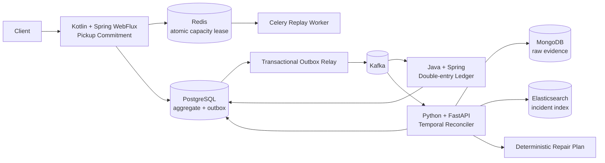

# Pickup Pact

**예약 픽업 약속의 시간적 정합성을 지키는 백엔드 시스템**

**Live Demo:** <https://pickup-pact-demo.onrender.com>  
**Demo:** FastAPI 기반 인터랙티브 운영 콘솔 · 합성 데이터만 사용

> “12:30에 준비됩니다”라고 확정한 뒤, 취소 이벤트가 늦게 도착하거나 Kafka가 결제 이벤트를 중복 전달하고, 매장 제조 수용량이 갑자기 줄어들면 주문·결제·정산·적립 상태를 어떻게 다시 맞출 것인가?

Pickup Pact는 메뉴/장바구니 CRUD 클론이 아니라 **확정된 픽업 약속 이후 분산 시스템에서 발생하는 정합성 문제**를 다룹니다. 핵심은 `occurred_at`과 `received_at`을 분리하고, 삭제가 아닌 보상 분개와 replay 가능한 근거를 통해 상태를 복구하는 것입니다.

## 30초 데모

첫 화면에서 바로 네 가지 장애 시나리오를 실행할 수 있습니다.

1. **늦게 도착한 취소** — 취소가 실제로는 먼저 일어났지만 정산·포인트 적립 후 서버에 도착
2. **Kafka 중복 전달** — 동일 financial event가 다시 전달되지만 금전 부작용은 한 번만 허용
3. **매장 수용량 급감** — 이미 확정한 픽업 수량보다 제조 가능 수량이 작아짐
4. **동일 event_id 금액 충돌** — 안전한 redelivery와 상류 시스템 오류를 semantic fingerprint로 구분

데모에서 `수신 순서`와 `실제 발생 순서`를 바꿔 보면 왜 단순 message-order 처리로는 문제를 해결할 수 없는지 바로 확인할 수 있습니다. **“백엔드로 재생하기”** 버튼은 정적 애니메이션이 아니라 FastAPI API를 호출해 anomaly, repair command, evidence event IDs를 다시 계산합니다.

로컬 실행:

```bash
docker build -f Dockerfile.demo -t pickup-pact-demo .
docker run --rm -p 10000:10000 pickup-pact-demo
# http://localhost:10000
```

## 핵심 설계



### 시스템 불변식

- 픽업 확정에는 **capacity lease + payment authorization**이 모두 필요합니다.
- Redis Lua 경로에서는 동일 슬롯의 제조 capacity를 원자적으로 초과할 수 없습니다.
- 같은 `event_id` + 같은 semantic fingerprint는 안전한 재전달로 간주해 financial side effect를 다시 만들지 않습니다.
- 같은 `event_id` + 다른 fingerprint는 조용히 dedupe하지 않고 격리합니다.
- 취소가 뒤늦게 도착해도 이미 기록한 회계 이력을 삭제하지 않고 **compensating entry**를 생성합니다.
- canonical state는 수신 순서가 아니라 business occurrence time과 근거 이벤트에서 재구성합니다.
- AI는 사고 설명·테스트 생성·리뷰를 도울 수 있지만 금전 repair command를 직접 실행하지 못합니다.

## 공고 스택 → 실제 구현

| 공고 기술 | 프로젝트에서 맡은 역할 |
|---|---|
| Kotlin / Spring WebFlux | Pickup Commitment aggregate와 reactive API |
| Java / Spring | 이중 분개 Ledger, semantic idempotency |
| Python / FastAPI | event-time reconciliation engine, 공개 데모 API |
| Flask | 원본 ops-console 구현 경로의 운영 콘솔; 공개 데모는 배포 단순화를 위해 FastAPI 단일 프로세스로 구성 |
| PostgreSQL | commitment, transactional outbox, ledger, reconciliation audit |
| MongoDB | 재생 가능한 raw event evidence archive |
| Redis | Lua 기반 atomic capacity lease + Celery broker |
| Elasticsearch | incident 검색/포렌식 index |
| Kafka | commitment/financial domain events |
| Celery | 비동기 replay worker와 retry/backoff |
| DDD / EDA / CQRS | bounded context, domain event, rebuildable projection |
| Docker / Kubernetes | 서비스 이미지, Compose, K8s deployment |
| AWS | RDS PostgreSQL · ElastiCache Redis · MSK Serverless Terraform blueprint |
| Jenkins | JVM/Python/Docker 검증 pipeline |
| Datadog / Elastic APM | anomaly monitor와 cross-service trace contract |
| Claude Code / Cursor | `CLAUDE.md`, `.cursor/rules/project.mdc` |
| ChatGPT / Claude / Gemini | provider-neutral incident review prompt/eval contract |
| n8n / Make | CI regression triage automation template |
| Slack / Jira / Notion | 자동화의 선택적 destination; 실제 계정 연동을 했다고 주장하지 않음 |
| REST / OpenAPI / AsyncAPI | HTTP 및 event contract |

상세 매핑: [docs/jd-traceability.md](docs/jd-traceability.md)

## 검증된 합성 실험

초기 로컬 구현에서 seed 42로 **20,000 orders / 101,588 events**를 생성해 단순 receive-order 처리와 정합성 모델을 비교했습니다.

| correctness fault | naive | Pickup Pact model |
|---|---:|---:|
| capacity oversubscribed units | 194 | **0** |
| duplicate financial posts | 1,207 | **0** |
| late-cancel stale financial orders | 381 | **0** |
| deterministic repair commands | - | 762 |

5개 seed 총 100,000 orders에서도 세 오류 유형은 모델 경로에서 0이었습니다. 원본 결과는 [artifacts/consistency-benchmark.json](artifacts/consistency-benchmark.json), [artifacts/consistency-matrix.json](artifacts/consistency-matrix.json)에 보존했습니다.

**이 수치는 합성 correctness 실험이며 production TPS/SLA 주장이 아닙니다.**

## 저장소 구조

```text
demo/                         # 면접관용 FastAPI 인터랙티브 데모
services/
  commitment-service/         # Kotlin + Spring WebFlux
  ledger-service/             # Java + Spring
  reconciler/                 # Python + FastAPI + Celery
contracts/                    # OpenAPI / AsyncAPI
sql/                          # PostgreSQL schema
infra/
  k8s/                        # Kubernetes
  aws/terraform/              # RDS / ElastiCache / MSK blueprint
  observability/              # Datadog / Elastic APM
automation/                   # n8n / Make
ai/                           # incident triage prompt + eval cases
artifacts/                    # measured synthetic evidence
```

## 개발/검증

Fast path:

```bash
# interviewer demo
pip install -r demo/requirements.txt
pytest -q demo/test_demo.py
uvicorn demo.main:app --host 0.0.0.0 --port 10000
```

Core checks:

```bash
pip install -e "services/reconciler[dev]"
pytest -q services/reconciler/tests
mvn -B test
```

Full local topology:

```bash
cp .env.example .env
docker compose up --build
```

GitHub Actions는 Python reconciler, demo tests/Docker build, Kotlin/Java Maven tests, OpenAPI/AsyncAPI parse, Terraform validate를 분리해 검증합니다. Jenkinsfile도 같은 검증 경계를 사용합니다.

## 왜 이 주제인가

공개 주문 백엔드 포트폴리오는 `order/payment/restaurant + Kafka + Saga/Outbox/CQRS` 조합이 이미 매우 흔합니다. Pickup Pact는 패스오더를 복제하는 대신 **예약 픽업 약속이 이미 확정된 이후 발생하는 시간적 정합성 문제**를 중심에 둡니다.

특정 회사의 비공개 시스템을 추정하거나 복제하지 않았습니다. 공개 채용 요구와 일반적인 스마트오더 장애 조건에서 독립적으로 설계했습니다.

자세한 선택 근거: [docs/topic-research.md](docs/topic-research.md)

## 범위와 한계

- 실제 고객·점주·결제 데이터는 사용하지 않았습니다.
- AWS/Kubernetes/Datadog/Elastic APM 설정은 실행 가능한 배포/관측 blueprint이며, 별도 실행 증거가 없는 외부 운영 환경을 실제 운영했다고 표현하지 않습니다.
- Slack/Jira/Notion/n8n/Make는 integration artifact이며 실제 SaaS 계정 연결을 주장하지 않습니다.
- 공개 데모는 빠른 검토를 위해 compact FastAPI process로 배포하며, 전체 분산 topology와 동일하다고 가장하지 않습니다.
- AI 결과는 advisory-only이고 정산·포인트·환불 repair는 deterministic boundary에서만 생성합니다.

## License

All rights reserved. 별도의 오픈소스 라이선스를 부여하지 않습니다.
