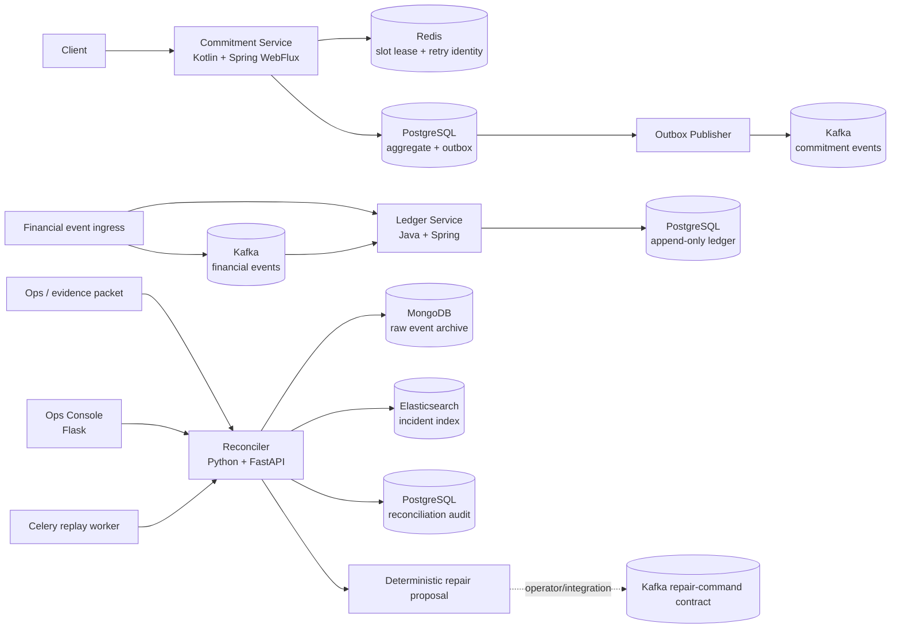

# Pickup Pact

**A temporal-consistency backend for scheduled pickup commitments.**

Pickup Pact is a portfolio system for a difficult part of smart-order platforms that ordinary food-order clones usually skip: **keeping a promised pickup time, payment, reward, and settlement consistent when events are duplicated, delayed, reordered, or a store's preparation capacity changes after the promise was made.**

The project is intentionally **not** another menu/cart/order CRUD demo. It treats a pickup promise as a domain commitment with explicit invariants, a capacity lease, event-time vs receive-time semantics, compensating financial entries, replayable evidence, and operator-facing reconciliation.

## 30-second interactive demo

The public-facing demo is designed so an interviewer can understand the failure boundary **without reading JSON or architecture documents first**. The first scenario is a delayed cancellation: the cancellation happened before settlement and reward, but reached the service 45 seconds late. One click replays the real FastAPI reconciliation engine and shows:

`what happened → anomaly detected → deterministic repair plan → evidence events`

The Korean demo includes four scenarios:

- **Late cancellation** — detect settlement/reward posted after an earlier business-time cancellation and propose compensating ledger entries.
- **Kafka redelivery** — suppress duplicate financial side effects and rebuild a drifted CQRS projection.
- **Capacity drop** — move an already confirmed pickup promise to `AT_RISK` and request reslot review.
- **Conflicting duplicate** — distinguish safe redelivery from the same event ID carrying a different financial payload and isolate it for manual review.

Run the single-container portfolio demo:

```bash
docker build -f Dockerfile.demo -t pickup-pact-demo .
docker run --rm -p 10000:10000 pickup-pact-demo
```

Open <http://localhost:10000>. `Dockerfile.demo` intentionally co-locates the Flask UI and FastAPI reconciler only for a low-friction portfolio deployment; the production-oriented service boundaries remain separate in `docker-compose.yml` and Kubernetes manifests. A Render Blueprint is included in [`render.yaml`](render.yaml).

## Why this topic

A review of public restaurant/order repositories found that the common portfolio pattern is already saturated: `order-service + payment-service + restaurant-service + Kafka + Saga/Outbox/CQRS`. There are also public coffee-shop queue/load-balancing simulators. Pickup Pact therefore focuses on a rarer failure boundary: **scheduled pickup promise drift across capacity, payment, loyalty, and settlement**. See [`docs/topic-research.md`](docs/topic-research.md).

## Product scenario

A customer chooses **12:30 pickup**. The system temporarily leases preparation capacity, authorizes payment, and confirms the promise. Later, any of these can happen:

- a payment webhook is delivered twice;
- a cancellation occurred earlier but arrived after settlement;
- a store capacity revision invalidates an already promised slot;
- Kafka redelivers an event;
- a stale CQRS projection says an order is still confirmed;
- rewards are granted even though a late cancellation should have prevented them.

Pickup Pact reconstructs the canonical event-time state, identifies the drift, and emits deterministic repair actions such as `REVERSE_SETTLEMENT`, `REVERSE_REWARD`, `REBUILD_PROJECTION`, or `RESLOT_REVIEW`.

## Architecture



### Bounded contexts

| Context | Main responsibility | Primary stack |
|---|---|---|
| Pickup Commitment | quote/hold/confirm/cancel a pickup promise, enforce capacity and idempotency invariants | Kotlin, Spring Boot, WebFlux, PostgreSQL, Redis |
| Financial Ledger | balanced settlement/reward/refund entries with semantic event-idempotency and conflicting-reuse detection | Java, Spring Boot, PostgreSQL, Kafka |
| Reconciliation | event-time replay, drift detection, repair planning, persistence/evidence adapters, AI-assisted incident explanation | Python, FastAPI, Celery, MongoDB, Elasticsearch, PostgreSQL |
| Operations | replay console and incident lookup through the reconciliation API | Flask, FastAPI, Elasticsearch |

## Domain invariants

1. A commitment cannot become `CONFIRMED` without both an active capacity lease and payment authorization.
2. A slot never allocates more preparation units than its capacity under the atomic lease path.
3. A domain event produces financial side effects at most once, even under redelivery.
4. A cancellation never deletes accounting history; it produces compensating entries.
5. Canonical state is reconstructed by `occurred_at` and causal metadata, not blindly by delivery order.
6. Read models are disposable: a drifted CQRS projection is rebuilt from immutable event evidence.
7. AI output is advisory only; repair commands are generated by deterministic rules and validated schemas.

## Skill coverage for the target backend role

| Job skill | Where it is used |
|---|---|
| Kotlin | reactive pickup-command service |
| Java | transactional double-entry ledger service |
| Python | reconciliation engine, benchmark, AI-review harness |
| Spring / WebFlux | reactive command/API path and ledger adapter |
| FastAPI | reconciliation REST API and OpenAPI generation |
| Flask | lightweight operator console |
| PostgreSQL | aggregate state, outbox, append-only ledger, reconciliation audit |
| MongoDB | schemaless raw event archive for forensic replay |
| Redis | atomic slot admission, expiring lease tokens, retry/idempotency fingerprints |
| Elasticsearch | searchable event/incident timeline |
| Kafka | domain-event transport and asynchronous workflows |
| Celery | asynchronous reconciliation/replay worker with retry/backoff |
| AWS | EKS/RDS/ElastiCache/MSK-oriented deployment blueprint |
| Kubernetes | manifests for stateless services, probes, resource limits |
| Docker | per-service images + local Compose stack |
| Jenkins | verification, tests, benchmark, optional container build |
| Datadog | service/env tags, metric/monitor blueprint |
| Elastic APM | trace propagation and Python/JVM integration notes |
| Claude Code / Cursor / Claude / ChatGPT / Gemini | agent-specific repository guidance + provider-neutral AI development-review harness and prompt/eval suite; external execution is optional and never fabricated |
| n8n / Make | PR/performance regression triage workflow templates |
| Slack / Jira / Notion | optional collaboration destinations in automation templates; no external account activity is claimed |
| DDD / EDA / CQRS | bounded contexts, aggregates, domain events, separate read model |
| REST / OpenAPI | explicit API contract in `contracts/openapi.yaml` |

## Executable evidence

The repository includes a deterministic synthetic benchmark instead of invented production numbers. It compares a naive receive-order implementation with the proposed idempotent/atomic/reconciliation path under capacity races, duplicate events, and late cancellations.

Run:

```bash
make test
```

The benchmark writes `artifacts/consistency-benchmark.json`; a five-seed robustness matrix is also stored in `artifacts/consistency-matrix.json`. The checked-in seed-`42` run simulated **20,000 orders / 101,588 events**: the naive model produced **194 capacity oversubscribed units, 1,207 duplicate financial posts, and 381 stale financial orders after late cancellation**; the modeled atomic/idempotent repair path produced `0` for those three correctness faults and emitted `762` repair commands. These are synthetic correctness results, **not production TPS/latency claims**. Exact scope is in [`docs/performance.md`](docs/performance.md). A separate repeated loopback FastAPI baseline (2,000 requests × 3 runs per concurrency) is also checked in; it recorded zero failures at concurrency 10/50/100, but persistence was disabled and the raw variance is preserved, so it is presented only as local runtime evidence—not production capacity.

## API highlights

- `POST /api/v1/commitments/hold` — create a short-lived pickup capacity lease
- `POST /api/v1/commitments/{id}/confirm` — confirm only when lease + payment invariants hold
- `POST /api/v1/reconcile` — compare receive-order state with canonical event-time state
- `POST /api/v1/replay` — return deterministic anomaly and repair plan
- `GET /api/v1/incidents/{aggregateId}` — query indexed reconciliation incidents when Elasticsearch persistence is enabled

See [`contracts/openapi.yaml`](contracts/openapi.yaml) and [`contracts/asyncapi.yaml`](contracts/asyncapi.yaml). The financial ledger accepts the same idempotent posting contract over REST or `pickup.financial.events.v1`, so retry behavior can be exercised without pretending an external payment provider exists.

## AI-first development workflow

The role description emphasizes using AI through the entire engineering lifecycle. This repository therefore includes a reproducible workflow rather than a README-only claim:

- PRD → bounded-context / invariant checklist prompt
- OpenAPI change review prompt
- SQL `EXPLAIN` review prompt
- failure-log → incident hypothesis prompt
- test-case generation prompt with negative cases
- provider-neutral JSON response schema and offline deterministic fallback
- n8n/Make templates that can route validated findings to Slack/Jira/Notion

AI suggestions cannot directly issue repair commands. The reconciliation engine validates inputs and derives commands from deterministic rules. See [`docs/ai-first-workflow.md`](docs/ai-first-workflow.md).

## Local run

```bash
cp .env.example .env
docker compose up --build
```

Core endpoints:

- Commitment API: `http://localhost:8080`
- Ledger API: `http://localhost:8081`
- Reconciler: `http://localhost:8000/docs`
- Ops console: `http://localhost:5000`

The local Compose topology is designed as a reproducible demo. The AWS/Kubernetes files are deployment blueprints; **this repository does not claim a real AWS deployment unless one is actually executed and evidenced later.**

## Repository quality gates

- Python unit tests for canonical replay, duplicate handling, repair planning, and API behavior
- Kotlin and Java pure-domain smoke execution (`kotlinc`/`javac` + runtime assertions)
- GitHub Actions full Maven build/test, contract parse, Docker image build, and Terraform validation on push/PR
- deterministic consistency benchmark
- repository guard that rejects accidental license files, secret-like values, and missing required skill artifacts
- Jenkins pipeline for the target team's CI/CD stack

## Review map

- [`docs/jd-traceability.md`](docs/jd-traceability.md) — every target-role skill → concrete artifact
- [`docs/design-provenance.md`](docs/design-provenance.md) — what engineering patterns were reused vs what is new
- [`docs/topic-research.md`](docs/topic-research.md) — public-project research and rejected common themes
- [`docs/runbook-late-event.md`](docs/runbook-late-event.md) — incident response for delayed/reordered facts

## Limitations

- Synthetic consistency/load scenarios are not production traffic measurements.
- External LLM calls require the user's own provider credentials; offline mode remains deterministic.
- AWS, Datadog, Elastic APM, Slack, Jira, Notion, n8n, and Make are represented by runnable/configurable integration artifacts but are not claimed as live external deployments in this repository.
- The project intentionally prioritizes backend domain depth and failure recovery over a consumer-facing mobile UI.

## License

No open-source license is provided for this portfolio repository. All rights reserved.
